# 서울시 행정동별 요양시설 유효공급 격차: 보고서 핵심

초고령 사회, 서울의 의료·돌봄 인프라는 어디에 더 필요한가? 분석의 단계별 핵심 문장과 그림을 모았다. 문장은 각 노트북이 계산값으로 생성해 출력한 것을 그대로 옮겼다(`python 보고서_핵심_만들기.py`로 다시 만든다). 그림 경로는 이 파일 기준 상대 경로다.

- 기준 시점: 시설 2024-07-16, 인구·등급판정 2024-07-31
- 주 설정: 수요 버전 A(서울 공통 인정률), 품질 가중 q = 가동률 비, 주 반경 5km(민감도 10km), 핵심 결과는 3·5·10·15km 모두 하위 10%인 12개 동

## ① 공간 준비

노트북: `01_공간준비.ipynb`

### 핵심 문장

> 서울 426개 행정동과 경기·인천 전체 757개 읍면동을 분석 범위로 두었다. 입소시설 3,167곳 중 3,164곳(99.9%)의 좌표를 확보했으며, 분석 범위 안 시설은 3,164곳(서울 484곳)이다.

### 그림

- `outputs/행정동_시설_지도.png`: 분석 범위(서울·경기·인천)의 행정동과 입소시설 위치(점 크기: 정원)
  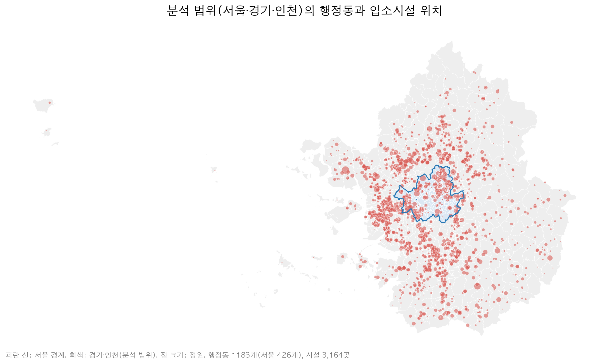

## ② 동별 수요 추정

노트북: `02_수요추정.ipynb`

### 핵심 문장

> 행정동 단위 중증 돌봄 수요는 직접 관측되지 않으므로, 동별 연령 구조(65~74세, 75~84세, 85세 이상)에 서울의 연령별 장기요양 1~2등급 인정률(65~74세 0.3%, 75~84세 1.5%, 85세 이상 6.0%)을 곱하는 간접표준화로 추정했다. 서울 426개 행정동의 추정 수요는 중앙값 49명이고 하위 10% 동은 27명 이하, 상위 10% 동은 80명 이상이며, 가장 많은 곳은 진관동(은평구) 119명이다. 구별 실제 인정률 대신 서울 공통 인정률을 쓴 것은, 구별 인정률에 연령 구조 외에 신청 성향과 시설 입소에 따른 주소 이동이 섞일 수 있기 때문이다. 구별 연령표준화 1~2등급 인정비와 75세 이상 1,000명당 입소 정원의 스피어만 상관은 0.34(p = 0.10)였고, 시설 입소가 드문 4~5등급에서도 0.62(p = 0.001)로 나타났다.

> 참고: 65세 이상 인구가 100명 미만인 동(반포본동, 둔촌1동)은 2024년 7월 재건축으로 인구가 거의 없다.

### 그림

- `outputs/동별_수요_지도.png`: 동별 추정 1~2등급 수요: 서울 공통 인정률(A), 구별 인정률(B), B÷A
  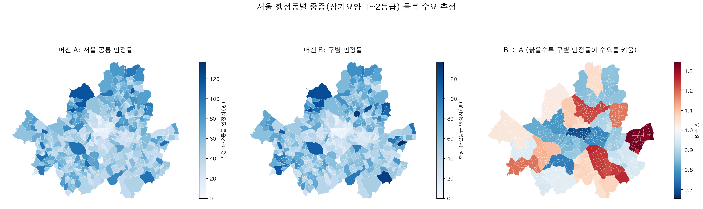
- `outputs/수요_주소이동_점검.png`: 구별 연령표준화 인정비와 입소 정원의 관계(1~2등급 vs 대조군 4~5등급)
  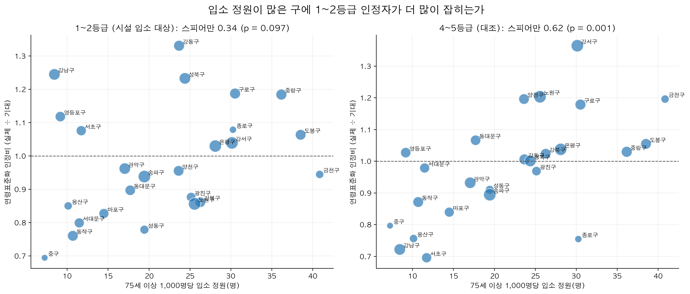

## ③ 공급 품질

노트북: `03_공급품질.ipynb`

### 핵심 문장

> 서울 입소시설의 잔여정원 1,467석(1~2등급 인정자 대비 6.3%) 가운데 평가등급 A·B 시설에 있는 자리는 400석(27%)이고, C~E등급 시설에 558석(38%), 아직 평가를 받지 않은 시설에 509석(35%)이 있다. 미평가 시설의 빈자리 중 77%는 2022년 이후 문을 연 시설에 있고, 개원 후 2년 이상 지난 2020~2021년 개원 미평가 시설의 가동률은 97%로 평가 시설 평균(92%)보다 오히려 높다. 미평가 시설의 빈자리는 품질보다 개원 초기에 입소자를 채워 가는 과정을 반영한다고 보는 것이 타당하다. 평가등급 A·B 시설의 빈자리만 세면 1~2등급 인정자 100명당 1.7석이다.

> 공급의 질은 국민건강보험공단 장기요양기관 평가등급(2021년 정기평가)으로 반영했다. 전국 평가 입소시설 3,876곳의 가동률은 A등급 87.9%에서 E등급 72.5%로 등급이 낮을수록 낮았고(15.4%p 차이), 가동률이 전반적으로 높은 서울에서도 A등급 97.2%, E등급 84.3%로 방향이 같았다. 정원 규모·공동생활가정 여부·시도를 통제한 회귀에서도 E등급 시설의 가동률은 A등급의 0.81배 수준이었다. 이에 따라 A등급 대비 가동률 비(B 0.96, C 0.91, D 0.90, E 0.82)를 품질 가중치로 삼아 정원에 곱한 값을 유효 공급으로 정의했다.

### 그림

- `outputs/등급별_가동률.png`: 평가등급별 입소시설 가동률(전국·서울), 부트스트랩 95% 신뢰구간
  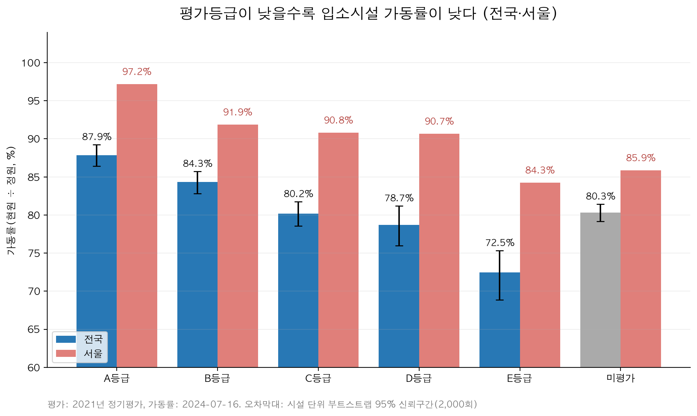

## ④ E2SFCA 접근성

노트북: `04_E2SFCA.ipynb`

### 핵심 문장

> 품질 가중치를 'A·B등급 1, 나머지 0.5'로 극단적으로 바꿔도 동 순위 상관은 0.993, 하위 10% 동의 겹침은 86%이며, 가중치를 아예 빼도 각각 1.000, 100%다. 시설 품질은 동별 격차의 구조를 바꾸지 않으며, 격차는 시설의 위치와 정원 규모에서 나온다.

> 이용 반경 5km와 시설 품질을 반영한 E2SFCA로 보면, 서울 행정동의 장기요양 1~2등급 인정자 100명당 유효 정원은 중앙값 67.5석이지만 하위 10% 동은 28.5석 이하, 상위 10% 동은 109.8석 이상으로 3.8배 차이가 난다(반경 10km에서는 중앙값 77.7석, 하위 10% 45.4석 이하, 상위 10% 115.2석 이상). 어느 동이 가장 부족한지는 반경에 따라 달라지므로, 반경을 3·5·10·15km로 바꿔도 모두 하위 10%에 드는 동을 우선 지역으로 삼았다. 이런 동은 12곳으로 동작구(사당2동·사당3동·사당1동·흑석동), 용산구(서빙고동·이촌1동·보광동·한강로동), 서초구(반포2동·방배본동·반포3동·방배4동)에 모여 있다. 이 동들의 100명당 유효 정원은 반경 5km 기준 15.8~25.0석으로 서울 중앙값의 37% 이하이고, 반경 10km 기준으로도 33.7~43.4석(서울 중앙값 77.7석)이다. 자치구 단위 정원 지표와의 순위 상관은 0.81로 큰 흐름은 같지만, 종로구는 이웃 지역 시설과 수요를 함께 고려하면 순위가 5위에서 16위로 내려가고 서대문구는 20위에서 13위로 올라간다.

### 그림

- `outputs/동별_접근성_지도.png`: 반경 5km 기준 동별 1~2등급 100명당 유효 정원(5분위), 굵은 테두리는 하위 10% 동
  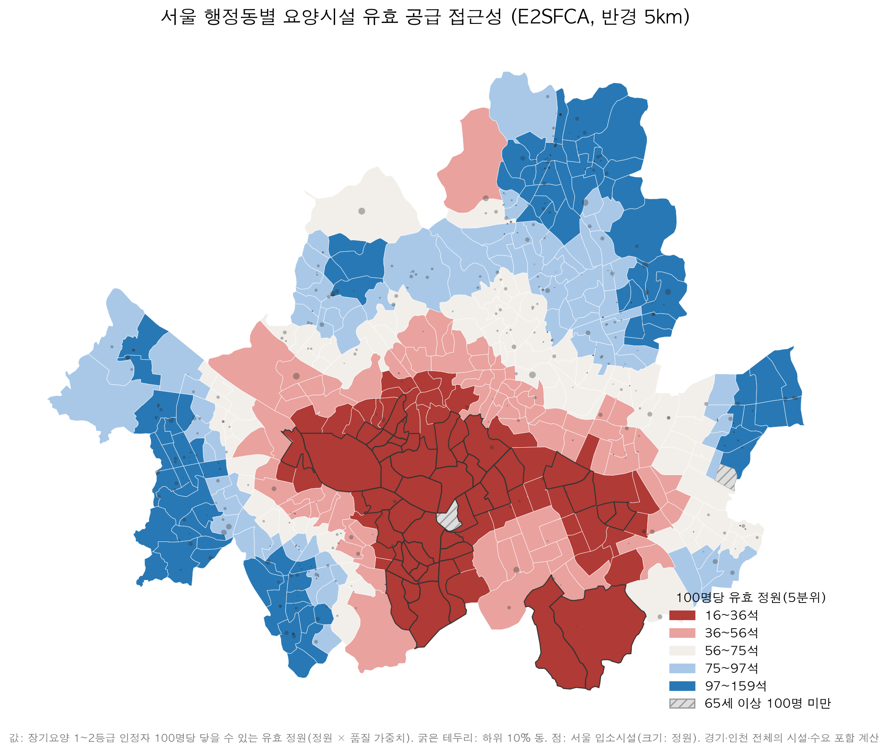
- `outputs/견고한_우선동_지도.png`: 반경 3·5·10·15km 모두에서 하위 10%인 견고한 우선 동 12곳
  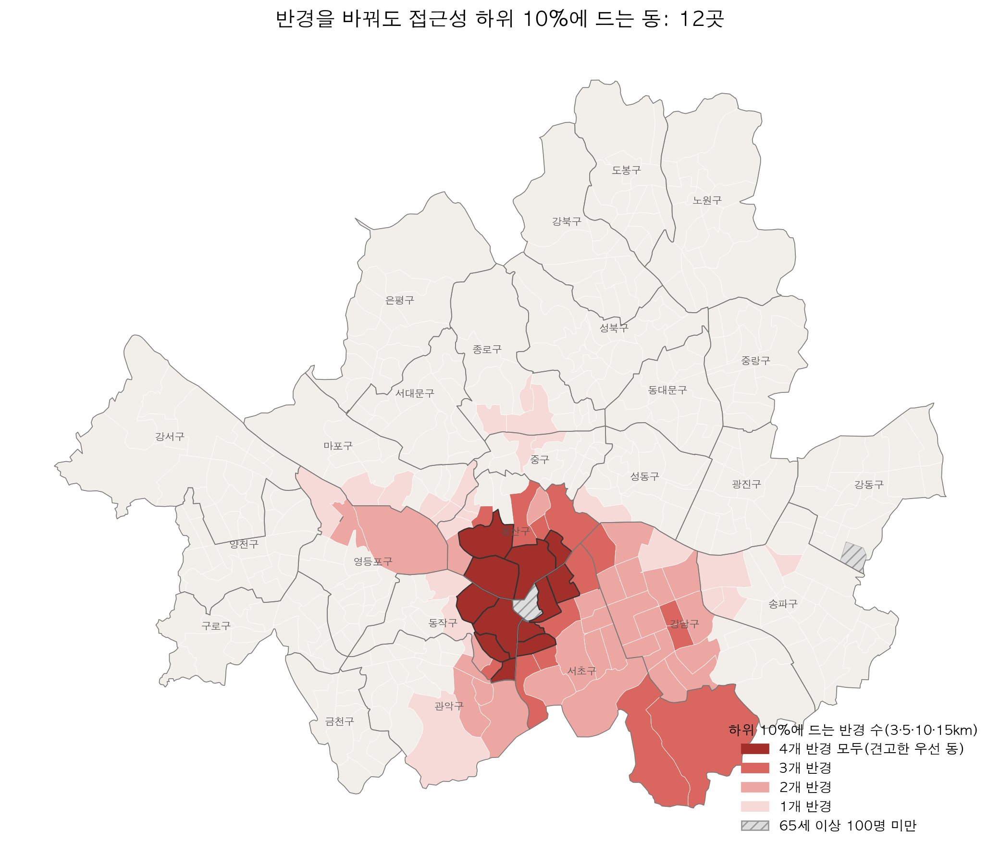

## ⑤ 검증

노트북: `05_검증.ipynb`

### 핵심 문장

> 동별 접근성 격차는 시설의 위치와 정원 규모에서 나온다. 품질 가중치를 'A·B등급 1, 나머지 0.5'로 극단적으로 바꿔도 동 순위 상관이 0.993이어서 순위가 거의 그대로다. 반면 남은 빈자리가 어디에 있는지는 평가등급과 더 관련된다. 서울 입소시설의 정원가중 가동률은 A등급 97%, E등급 84%다.

> 지표가 실제 이용과 맞는지 확인하기 위해, 시설별 수요 압력(정원 1석당 반경 5km 안의 가중 수요)이 높은 시설일수록 실제로 만실(잔여정원 1석 이하)인지 서울과 인근 경기·인천 입소시설 1,558곳으로 분석했다. 평가등급·정원 규모·공동생활가정 여부를 통제해도 수요 압력이 2배 높은 시설은 만실일 오즈가 1.29배(95% 신뢰구간 1.16~1.44, p < 0.001)였다. 반경 3~15km 가운데 AIC는 반경이 넓을수록 낮아져 15km에서 가장 낮았다(격자의 끝이라 더 넓은 반경일 가능성도 있다). 그러나 이 관계는 주로 서울과 경기·인천 사이의 차이에서 나온다. 시도를 통제하면 반경 5km 압력의 오즈비는 1.10(p = 0.16)로 줄고, 서울 시설 483곳만 보면 0.65(p = 0.10)로 관계가 보이지 않는다. 서울 시설의 68%가 이미 만실이어서 서울 안의 동 간 차이는 만실 여부로 검증하기 어렵다. 즉 이 검증은 '서울 전체가 인근 수도권보다 빠듯하다'는 점을 지지하지만, 서울 안에서 어느 동이 더 부족한지는 만실 자료로 확인되지 않는다.

> 주 반경은 5km로 두고 10km를 민감도로 제시한다. 근거는 두 가지다. 첫째, 만실 모형의 AIC는 반경을 3km에서 15km까지 넓힐수록 계속 낮아져(수요 압력을 넣었을 때의 AIC 개선: 5km -20.9, 15km -47.0) 데이터로 최적 반경을 정할 수 없다. 둘째, 서울 시설만 보면 어느 반경에서도 수요 압력이 만실과 유의한 관계를 보이지 않는다(압력 2배당 오즈비 0.62~0.94, p ≥ 0.10). 넓은 반경에서의 적합도 개선은 서울 도심과 수도권 외곽 사이의 광역 차이를 반영한 것으로 보이며, 동 단위 격차를 가려내는 근거로 삼기 어렵다.

> 서울 안에서 시설의 충원 정도는 주변 수요(위치)보다 평가등급과 더 뚜렷하게 관련된다. 정원가중 가동률은 A등급 97%, E등급 84%이고, 서울 시설 483곳만 본 모형에서 정원 규모와 공동생활가정 여부를 통제하면 C~E등급 시설이 만실일 오즈는 A등급의 0.23~0.30배(95% 신뢰구간 하한 0.08, 상한 0.73)였다. 반면 B등급과 A등급의 차이는 유의하지 않았다(오즈비 0.63, 95% 신뢰구간 0.26~1.50). 평가등급은 2021~2022년에 측정되어 가동률(2024년 7월)보다 앞선다. 평가 시점이 가동률보다 앞서 시간 순서는 등급→충원 방향과 부합하지만, 인과를 확정하지는 않는다.

### 그림

- `outputs/반경별_적합도.png`: 반경별 수요 압력의 만실 설명력(ΔAIC, AUC)
  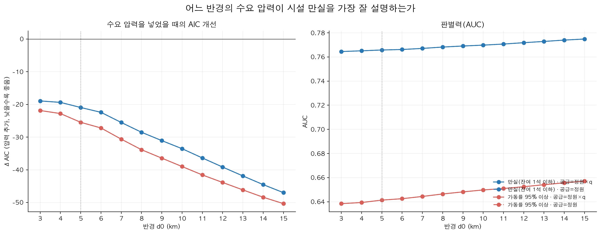

## ⑥ 부족 석수

노트북: `06_부족석수.ipynb`

### 핵심 문장

> 접근성이 서울 동 중앙값(장기요양 1~2등급 인정자 100명당 유효 정원 67.5석, 반경 5km)에 못 미치는 만큼을 수요에 곱해 합하면 2,402석이다. 새 시설은 어디에 짓든 분석 범위 전체의 접근성 총량을 자기 유효 정원만큼 늘리고 서울에는 최대 그만큼만 더해지므로, 서울 안의 부족을 없애려면 유효 정원 기준 최소 2,402석, 서울 평균 품질의 시설로 환산하면 정원 최소 2,553석이 필요하다(반경 10km 기준 2,049석). 견고한 우선 동 12곳을 모두 서울 중앙값까지 끌어올리려면, 정원 50석 시설을 이 동들의 부족이 가장 심한 곳부터 한 동에 한 곳씩 배치할 때 26곳, 정원 1,300석이 필요하다(한 동에 두 곳까지 허용하면 24곳). 새 시설의 공급은 반경 안 이웃 동과 나눠지므로, 우선 동 자체의 부족(295석)보다 훨씬 많은 정원이 든다. 전국과 비교하면 격차는 더 크다. 서울 동 중앙값은 전국 수준(100명당 159.8석)의 42%에 그치고, 서울 동의 90%가 전국 수준의 69%에 못 미친다.

### 그림

- `outputs/부족석수_지도.png`: 동별 부족 석수(A* = 서울 동 중앙값)와 전국 수준 대비 접근성(%)
  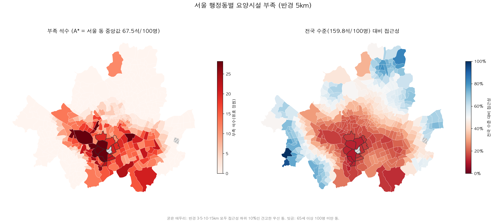
- `outputs/시뮬레이션_전후_지도.png`: 견고한 우선 동을 서울 중앙값까지: 50석 시설 26곳 추가 전후
  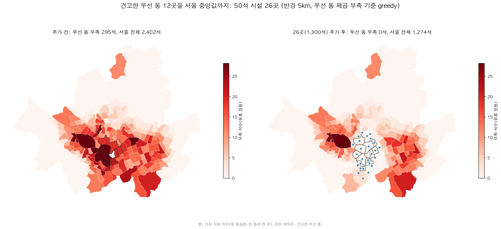
- `outputs/시뮬레이션_전후_지도_서울전체.png`: (참고) 서울 전체 동의 제곱 부족을 줄이는 순서로 배치했을 때(81곳)
  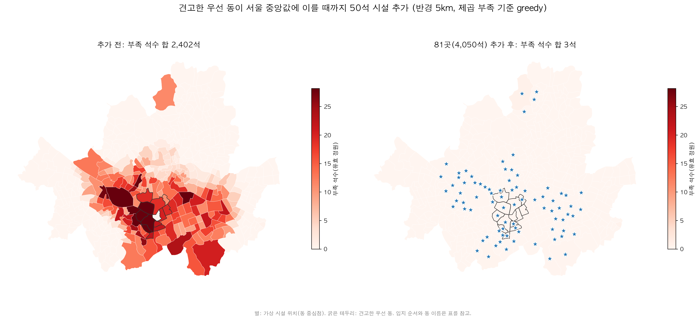

## ⑦ 미래 수요

노트북: `07_미래수요.ipynb`

### 핵심 문장

> 지금의 공급이 그대로라면 격차는 더 벌어진다. 동별 고령인구를 생존비로 늙히고 통계청 장래인구추계에 맞춰 보정하면, 서울의 65세 이상 장기요양 1~2등급 수요는 2024년 22,074명에서 2029년 29,189명, 2034년 36,899명으로 늘어난다. 2024년 서울 동 중앙값(100명당 유효 정원 67.5석)을 기준으로 고정하면 2034년에는 서울 동의 95%가 이 기준에 못 미쳐, 하락은 일부 지역이 아니라 서울 전반에서 일어난다. 서울 전체에서 부족을 없애는 데 필요한 정원의 하한은 2,553석에서 5,397석(2029), 10,014석(2034)으로 커진다. 하락 속도는 동마다 달라, 접근성이 가장 빠르게 떨어지는 10% 동(43곳)은 송파구 18곳·강동구 17곳·구로구 4곳 등 주변 고령 수요가 빠르게 느는 지역에 몰려 있다. 하락 속도는 동 자체보다 반경 5km 권역의 수요 증가로 정해지며(상관 -0.98), 최근 대규모 입주 동의 수요 증가를 서울 동 중앙값 수준으로 낮춰도 이 43곳 중 41곳이 그대로 남는다. 견고한 우선 동 12곳의 부족 석수는 295석에서 541석(2034)으로 늘어, 이 동들을 2024년 서울 중앙값까지 끌어올리는 데 지금은 정원 50석 시설 26곳(1,300석)이면 되지만, 2034년 수요를 기준으로는 동마다 한 곳씩으로는 반경 안 후보지가 모자라 도달할 수 없고, 한 동에 두 곳까지 모아야 48곳(2,400석)이 필요하다.

### 그림

- `outputs/미래_부족석수_지도.png`: 2034년 부족 석수와 2024년 대비 증가(파란 테두리: 하락 속도 상위 10%)
  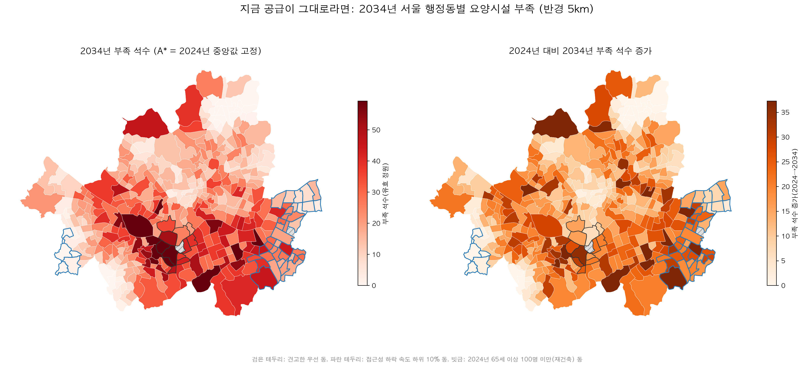
- `outputs/하락속도_지도.png`: 2024→2034 접근성 하락 속도, 점무늬는 최근 5년 대규모 입주 동
  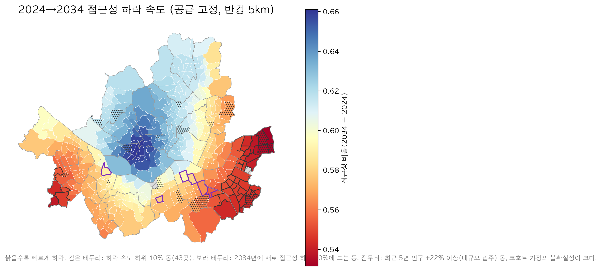

## 단계별 한계

- **① 공간 준비**: 시설 좌표는 주소 지오코딩 결과이며 3곳(서울 노원사랑요양원4, 9석)은 좌표를 얻지 못해 제외했고, 동 대표점은 인구가 아닌 경계의 기하 중심이다.
- **② 동별 수요 추정**: 동별 수요는 관측값이 아니라 연령 구조 × 서울 인정률로 추정한 값이며, 65세 미만 인정자(서울 1~2등급의 5.1%)는 제외했다.
- **③ 공급 품질**: 평가등급(2021~22년)과 가동률(2024년) 사이에 2~3년 시차가 있고, 미평가 시설의 빈자리는 대부분 개원 초기 충원 과정을 반영한다.
- **④ E2SFCA 접근성**: 거리는 직선거리라 한강변 동은 실제 이동거리를 과소평가하며(접근성 과대평가 방향), 도로망 거리는 후속 과제다.
- **⑤ 검증**: 서울 시설의 68%가 이미 만실이라 서울 안의 동별 순위는 만실 자료로 검증되지 않았고, 주소지별 입소 이용 자료나 대기자 수가 필요하다.
- **⑥ 부족 석수**: 필요 정원은 기준값을 2024년 서울 중앙값으로 고정한 하한이며, 후보지는 동 중심점이라 실제 부지·지가는 반영하지 않았다.
- **⑦ 미래 수요**: 코호트 방식은 동 단위 전입·전출을 반영하지 못해 대규모 입주·재개발 동(상일제1·2동, 고덕2동, 위례동, 거여2동, 둔촌1동 등)의 수치는 불확실성이 크며, 인정률과 공급은 2024년 수준으로 고정했다.
